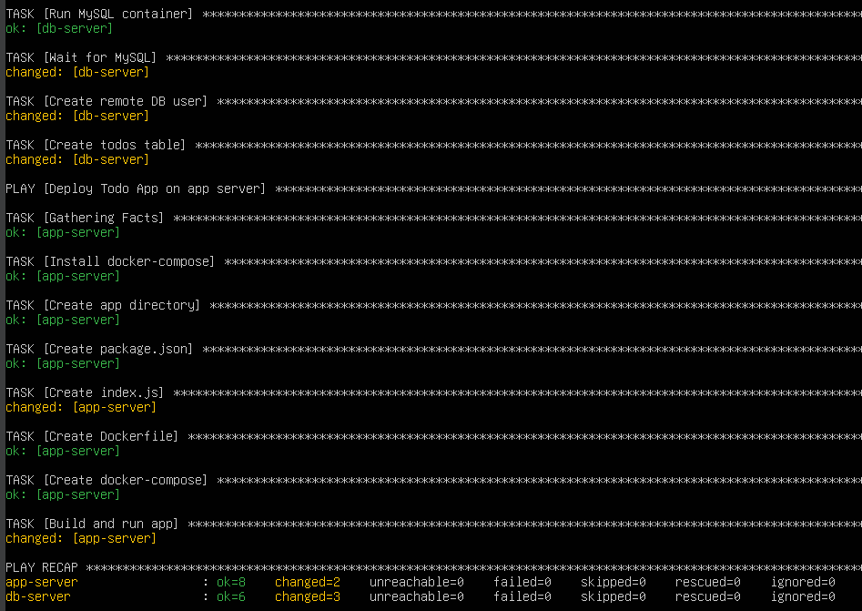
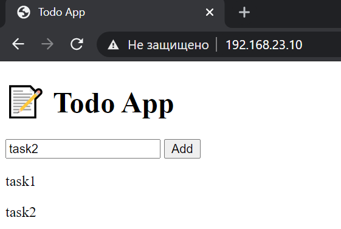
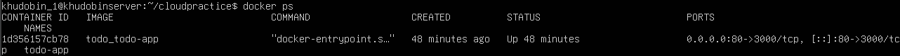
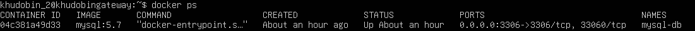

# Отчет по заданию: Развертывание Todo-приложения с MySQL с использованием Ansible

---

## Цель работы

Автоматизировать развертывание веб-приложения **Todo App** и базы данных **MySQL** на виртуальных машинах с использованием **Ansible и Docker**.

Обеспечить:
- сетевое взаимодействие между сервисами
- корректную работу REST API
- доступ к веб-интерфейсу через браузер

---

## Используемые инструменты

- Ubuntu Server
- Ansible
- Docker
- Docker Compose
- MySQL (контейнер)
- Node.js + Express (Todo App)
- Python3 + docker SDK (для Ansible)

---

## Конфигурация виртуальных машин

В работе использованы виртуальные машины:

### App VM (Todo App)
- IP: 192.168.23.10
- Роль: сервер приложения

### DB VM (MySQL)
- IP: 192.168.23.1
- Роль: сервер базы данных

---

## 1. Подготовка окружения Ansible

### Inventory файл

[app]
app ansible_host=192.168.23.10 ansible_user=khudobin_1

[db]
db ansible_host=192.168.23.1 ansible_user=khudobin_2

---

### Подготовка хостов

На обеих ВМ выполнено:

- установка Docker
- установка Python3
- установка python3-docker
- настройка SSH-доступа по ключам

---

## 2. Развертывание MySQL (DB VM)

### Параметры контейнера

- Image: mysql:5.7
- Container: mysql-db
- Port: 3306:3306
- Database: todo
- User: todo
- Password: todopass
- Root password: rootpass

---

### Конфигурация

- включён mysql_native_password
- разрешены подключения извне (0.0.0.0)
- используется Docker volume

---

## 3. Инициализация базы данных

CREATE TABLE IF NOT EXISTS todos (
  id INT AUTO_INCREMENT PRIMARY KEY,
  task VARCHAR(255) NOT NULL,
  completed BOOLEAN DEFAULT FALSE,
  created_at TIMESTAMP DEFAULT CURRENT_TIMESTAMP
);

---

## 4. Развертывание Todo App (App VM)

- установка Docker и Docker Compose
- сборка Node.js приложения
- запуск контейнера

---

## 5. Конфигурация приложения

host: 192.168.23.1
user: todo
password: todopass
database: todo

---

## 6. Плейбук

Плейбук состоит из двух частей: первая применяет роль `mysql` к хостам из группы `db`, вторая применяет роль `todo` к хостам из группы `app`.

*Скриншот успешного выполнения `ansible-playbook` :*

---

## 7. Веб-интерфейс

http://192.168.23.10/

*Скриншот интерфейса :*

---

## 8. Запуск

ansible-playbook deploy.yml -K

---

## 9. Результаты

- MySQL работает
- API работает
- UI доступен
- данные сохраняются

*Скриншот `docker ps` 1:*

*Скриншот `docker ps` 2:*

---

## Вывод

В ходе выполнения задания была успешно автоматизирована процедура развертывания двухкомпонентного приложения (веб-приложение и база данных) на отдельные виртуальные машины с использованием Ansible.

